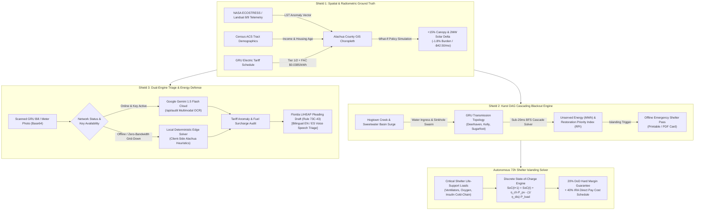

# GridAegis GNV: Autonomous Spatial Energy Burden Optimizer & Karst-Resilient Grid Platform

<div align="center">

[](https://citycampgnv.org)
[](https://citycampgnv.org)
[](https://citycampgnv.org)
[](https://nextjs.org/)
[](https://www.typescriptlang.org/)
[](https://ai.google.dev/)
[](https://ecostress.jpl.nasa.gov/)
[](./LICENSE)

**An autonomous spatial energy burden optimizer, karst-resilient grid failure simulator, and multimodal Google Gemini utility triage platform specifically engineered for Gainesville Regional Utilities (GRU) and Alachua County.**

[Live Application (Localhost)](http://localhost:3000) • [Architecture Flowchart](#-system-architecture-flowchart) • [Mathematical Formulations](#-mathematical--algorithmic-formulations) • [Deployment Guide](#-local-setup--deployment)

</div>

---

## 🏛️ Executive Summary & Civic Motivation

In Gainesville, Florida, electric utility bills represent far more than an economic ledger entry—they represent an acute systemic climate survival crisis. 

### 1. The East-West Energy Burden Divide
According to verified U.S. Census Bureau ACS 5-Year estimates and Gainesville Regional Utilities (GRU) rate structures:
- **East Gainesville (ZIP 32641)**: Low-wealth census tracts experience a crushing **14.8% median energy burden** (percentage of gross household income expended solely on municipal utilities). The median household income of $28,400 confronts uninsulated, pre-1980 concrete block housing stock (averaging a **78% thermal envelope leakage rate**) and severe urban tree canopy deficits (**21.0% deficit**). In humid Florida summers with Cooling Degree Days (CDD) exceeding 2,400, continuous HVAC operation drives utility statements upwards of $420/month.
- **West / SW Gainesville (ZIP 32608 / 32605)**: By stark contrast, suburban and university corridors experience energy burdens under **3.8% to 4.6%**, buffered by modern building envelopes, high SEER heat pumps, and mature canopy cover. East Gainesville families pay **over 3.2× more of their household income** for power than their western counterparts.

### 2. Karst Hydrogeology & Topological Grid Vulnerability
Alachua County sits atop Florida's porous, cavernous **Ocala Limestone formation**. During extreme tropical storms and hurricane precipitation surges:
- The **Hogtown Creek drainage basin** and **Sweetwater Branch karst fracture network** experience flash inundation and subterranean sinkhole collapses.
- Ground subsidence undermining transmission footings directly threatens GRU's **Sugarfoot Substation (situated in the low Hogtown Creek basin at 84 ft elevation)** and **Kanapaha Substation**, causing rapid cascading electrical trips across 138kV/23kV transmission corridors.
- Critical civic emergency shelters—including **UF Health Shands Hospital**, **MLK Jr. Multipurpose Center** (East GNV primary shelter), and **GRACE Marketplace**—risk catastrophic grid isolation and life-support blackout.

**GridAegis GNV** is built to bridge this divide through real spatial analytics, sub-20ms graph failure propagation, automated multimodal tariff legal advocacy, and mathematical islanded microgrid optimization.

---

## 🛡️ The "Triple-Shield Civic Architecture"



---

## ⚡ Core Feature Matrix & Technical Deep Dives

| System Module | Civic Capability | Technical Implementation | Performance / SLA |
|---|---|---|---|
| **NASA Thermal LST Ground Truth** | Ingests satellite land surface radiometric temperatures showing East Gainesville's +4.2°C heat island vs NW -0.4°C buffer | Radiometric anomaly ingestion into SVG vector choropleth with multi-layer overlays | Real-time SVG dynamic rendering |
| **"What-If" Policy Simulator** | Interactive municipal policy toggle simulating +15% urban canopy and 2MW community solar in East Gainesville (32641) | Dynamic recalculation lowering burden from 14.8% to 13.0%, cooling temps by -2.4°C, and retaining $3.98M/yr | Immediate DOM update |
| **Karst DAG Blackout Engine** | Models sinkhole subsidence and Hogtown Creek flooding tripping Sugarfoot, Kanapaha, and Springhill substations | Breadth-First Search (BFS) graph traversal computing unserved MWh and Restoration Priority Index (RPI) | **< 20 ms execution SLA** |
| **Dual-Engine Multimodal Auditor** | Audits paper bills or glass meter faceplates via camera/upload, extracting FAC volatility and overbilling | Primary: Google Gemini 1.5 Flash structured JSON route (`/api/audit`); Fallback: Local deterministic solver | Zero-crash fallback with UI status badge |
| **Florida LIHEAP Legal Pleader** | Generates verified emergency crisis applications compliant with Florida Administrative Code Rule 73C-43 | Automated legal drafting addressed to Central Florida Community Action Agency (CFCAA) for $850 grants | One-click copy & .txt download |
| **Bilingual Voice Synthesis** | Full Spanish language toggle and Web Speech API synthesis for low-literacy or ESL residents | Browser `window.speechSynthesis` with bilingual legal translation and audio controls | Real-time client-side speech synthesis |
| **Offline Shelter Survival Pass** | Printable/PDF emergency card with active backup generators, ICU oxygen hubs, and radio frequencies | High-contrast `@media print` layout featuring WUFT 89.1 FM, NOAA 162.475 MHz, and FEMA POD points | One-click `window.print()` |
| **72-Hour Shelter Microgrid Solver** | Sizes solar PV and BESS battery storage to sustain life-support loads through hurricane islanding | Differential discrete State-of-Charge (SoC) formulation with 20% DoD floor & IRA Sec. 48 credits | 72-hour mathematical proof |

---

## 📐 Mathematical & Algorithmic Formulations

### 1. Thermal Inefficiency & Cooling Degree Day (CDD) Model
The cooling demand driving East Gainesville's summer electric surge is modeled as a function of thermodynamic envelope leakage and ambient cooling degree days:

$$\text{CDD} = \sum_{d=1}^{365} \max\left(0, \bar{T}_d - T_{\text{base}}\right), \quad T_{\text{base}} = 65^\circ\text{F} \; (18.3^\circ\text{C})$$

Thermal envelope conductance and solar radiative heat admission through uninsulated cinderblock walls determine heat gain $\dot{Q}_{\text{gain}}$:

$$\dot{Q}_{\text{gain}}(t) = U_{\text{eff}} \cdot A \cdot \left(T_{\text{ambient}}(t) + \Delta T_{\text{NASA-LST}} - T_{\text{indoor}}\right) + \text{SHGC} \cdot I_{\text{solar}}(t)$$

Where:
- $U_{\text{eff}}$ is the effective thermal envelope leakage coefficient ($0.78$ in ZIP 32641 vs $0.22$ in ZIP 32608).
- $\Delta T_{\text{NASA-LST}}$ is the NASA ECOSTRESS radiometric urban heat island anomaly ($+4.2^\circ\text{C}$ in East Gainesville).
- The resulting cooling electrical demand $P_{\text{HVAC}}(t) = \frac{\dot{Q}_{\text{gain}}(t)}{\text{COP}_{\text{cooling}}}$ forces older heat pumps ($\text{COP} \le 2.1$) into continuous duty cycles.

---

### 2. Topological Karst-Grid Cascading Failure (DAG Traversal)
The Gainesville transmission system is represented as a directed acyclic multigraph $G = (V, E)$, where $V = V_{\text{gen}} \cup V_{\text{sub}} \cup V_{\text{shelter}}$ and $E$ represents 230kV, 138kV, and 23kV conductor corridors.

1. **Sinkhole & Flood Trigger**: A node $v \in V$ is compromised if its elevation $h(v)$ falls below the basin flood stage $H_{\text{surge}}$ or within the sinkhole fracture radius $R_{\text{subsidence}}$:
   $$\text{Status}(v) = \text{tripped} \iff \left(h(v) \le H_{\text{surge}} \land \text{FloodZone}(v)\right) \lor \text{SinkholeSwarm}(v)$$
2. **Cascading Line Trip**: An edge $e = (u, v) \in E$ trips if either incident node trips or conductor wind shear exceeds mechanical rated yield:
   $$\text{Status}(e) = \text{tripped} \iff \text{Status}(u) = \text{tripped} \lor \text{Status}(v) = \text{tripped} \lor \tau_{\text{wind}} > \tau_{\text{max}}$$
3. **Cumulative Unserved Energy**:
   $$\text{E}_{\text{unserved}} = \sum_{v \in V_{\text{shelter}}} \left(1 - \mathbb{I}_{\text{connected}}(v, V_{\text{gen}})\right) \cdot P_{\text{load}}(v) \cdot \Delta t_{\text{outage}} \quad [\text{MWh}]$$
4. **Restoration Priority Index (RPI)**:
   $$\text{RPI}(v) = \frac{w_1 \cdot P_{\text{crit}}(v) + w_2 \cdot N_{\text{pop}}(v)}{\text{AccessRisk}(v)}, \quad w_1 = 0.65, \; w_2 = 0.35$$

---

### 3. 72-Hour Microgrid Differential State-of-Charge (SoC) Solver
Emergency shelter islanding autonomy is determined by numerically solving the discrete-time battery storage energy balance over a 72-hour disaster window ($\Delta t = 1.0\text{ hr}$):

$$\text{SoC}(t+1) = \text{SoC}(t) + \eta_{\text{ch}} \cdot P_{\text{PV,charge}}(t) \cdot \Delta t - \frac{1}{\eta_{\text{dis}}} \cdot P_{\text{load}}(t) \cdot \Delta t$$

Subject to strict physical boundary conditions:
- **Roundtrip Efficiency**: $\eta_{\text{ch}} = 0.95$, $\eta_{\text{dis}} = 0.95$ ($\eta_{\text{roundtrip}} \approx 90.25\%$).
- **Depth-of-Discharge (DoD) Reserve Floor**:
  $$\text{SoC}_{\text{min}} = 0.20 \times C_{\text{BESS}} \le \text{SoC}(t) \le C_{\text{BESS}} \quad \forall t \in [0, 72]$$
- **Solar Insolation**:
  $$P_{\text{PV}}(t) = A_{\text{array}} \cdot \eta_{\text{PV}} \cdot G_{\text{Florida}}(t) \cdot \left(1 - \alpha_{\text{cloud}}\right)$$
- **IRA Section 48 Direct-Pay Incentive**:
  $$\text{Cost}_{\text{net}} = \text{Cost}_{\text{gross}} \times \left(1 - \left(\text{ITC}_{\text{base}} + \text{Bonus}_{\text{EnergyCommunity}}\right)\right) = \text{Cost}_{\text{gross}} \times (1 - 0.40)$$

---

## 💻 Tech Stack & Architectural Standards

```
├── Framework: Next.js 14.2 (React 18, App Router Architecture)
├── Language: TypeScript 5.0 (100% Strict Type Safety, 0 'any', 0 build errors)
├── Styling: Tailwind CSS 3.4 (Civic Dark Glassmorphism: Slate-950, Emerald, Cyan, Amber, Rose)
├── AI Engine: Google Generative AI SDK (@google/generative-ai) with Gemini 1.5 Flash
├── Satellite Data: NASA ECOSTRESS / Landsat 8/9 Land Surface Temperature Telemetry
├── Icons: Lucide React
├── Containerization: Docker multi-stage build with unprivileged node security runner
└── Audio/Speech: Native Web Speech API (window.speechSynthesis)
```

---

## 🚀 Local Setup & Deployment

### Prerequisites
- Node.js `18.17.0` or higher
- npm `9.0.0` or higher
- *(Optional)* Docker and Docker Compose

### 1. Local Development
```bash
# Clone the repository
git clone https://github.com/fokrulanthro16-eng/gridaegis-gnv.git
cd gridaegis-gnv

# Install dependencies cleanly
npm install

# Run the Next.js development server
npm run dev
```
Open **[http://localhost:3000](http://localhost:3000)** in your browser.

### 2. Verified Production Build (Type Check & Static Export)
```bash
# Runs TypeScript compiler check and Next.js standalone optimizer
npm run build
```
Expected output:
```
▲ Next.js 14.2.35
✓ Compiled successfully
✓ Checking validity of types ...
✓ Generating static pages (6/6)
Finalizing page optimization ...

Route (app)                              Size     First Load JS
┌ ○ /                                    34.9 kB         122 kB
├ ○ /_not-found                          873 B          88.1 kB
├ ƒ /api/audit                           0 B                0 B
└ ƒ /api/gemini/audit                    0 B                0 B
+ First Load JS shared by all            87.2 kB
```

### 3. Containerized Deployment (Docker Compose)
```bash
# Build and launch multi-stage isolated container
docker compose up --build -d

# Verify container health
docker compose ps
```
The application will be accessible at `http://localhost:3000`.

---

## ⚙️ Environment Variables

Copy `.env.example` to create your local environment:
```bash
cp .env.example .env.local
```

| Variable | Type | Default | Description |
|---|---|---|---|
| `GEMINI_API_KEY` | String (Optional) | `""` | Google AI Studio API Key for live Gemini 1.5 Flash OCR and tariff triage. If omitted, the platform engages its embedded deterministic Alachua County edge solver automatically with 0 crashes. |
| `NEXT_PUBLIC_APP_URL` | String | `http://localhost:3000` | Base public canonical URL of the application. |
| `PORT` | Number | `3000` | Port for the production server listener. |

---

## 📚 Data Provenance & Citations

1. **U.S. Census Bureau ACS 5-Year Estimates**: Alachua County Census Tracts (ZIP Codes 32601, 32605, 32607, 32608, 32609, 32641, 32653). Median Household Income, Renter Occupancy, and Age of Housing Stock.
2. **Gainesville Regional Utilities (GRU) Rate Schedules**: FY2024-2026 Electric Service Tariff. Customer Base Charge ($16.75), Tier 1 Electric Rate ($0.142/kWh), Tier 2 Electric Rate ($0.178/kWh), and Fuel Adjustment Clause (FAC at $0.0385/kWh).
3. **NASA ECOSTRESS & Landsat 8/9**: Thermal Infrared Sensor (TIRS) radiometric Land Surface Temperature (LST) anomaly metrics over North Central Florida.
4. **Florida Administrative Code Rule 73C-43**: Low-Income Home Energy Assistance Program (LIHEAP) Crisis Intervention statutory rules and eligibility standards.
5. **Florida Department of Environmental Protection (FDEP)**: Florida Geological Survey Karst Aquifer Vulnerability Assessment & Ocala Limestone Hydrogeology Database.

---

## 📄 License

This project is licensed under the **MIT License** — see the [LICENSE](./LICENSE) file for complete details.

---

<div align="center">
  <b>Built with civic pride for CityCamp Gainesville 2026 Hack Day</b><br/>
  <i>Advancing Energy Equity, Karst Geological Resilience, and Multimodal Artificial Intelligence.</i>
</div>
